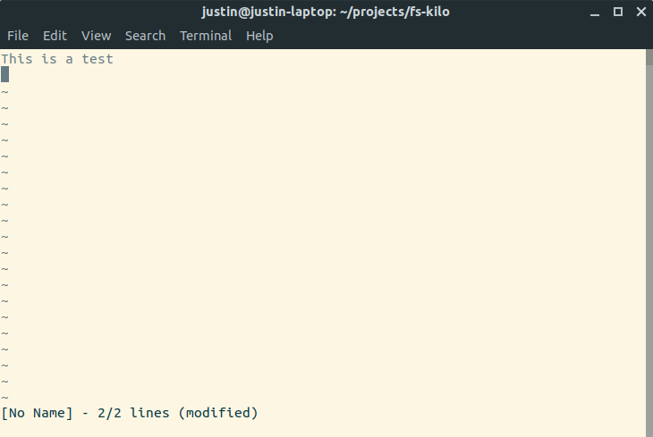

# fs-kilo

This is a F# port of the Kilo text editor from the [Build your own text editor](https://viewsourcecode.org/snaptoken/kilo/index.html) tutorial series.

To run

    dotnet run

You can optionally pass the path of a file to edit on the command line, e.g.

    dotnet run Program.fs

Commands:

- Ctrl-S = save
- Ctrl-Q = quit
- Ctrl-G = find
